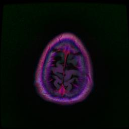
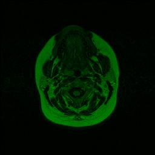
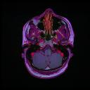
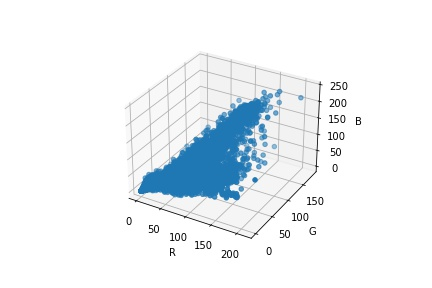
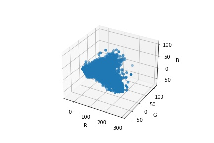
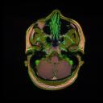
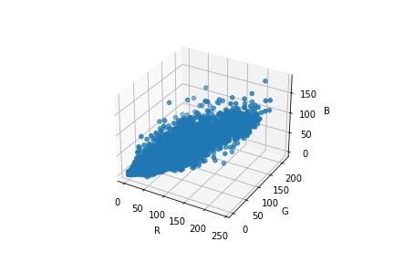
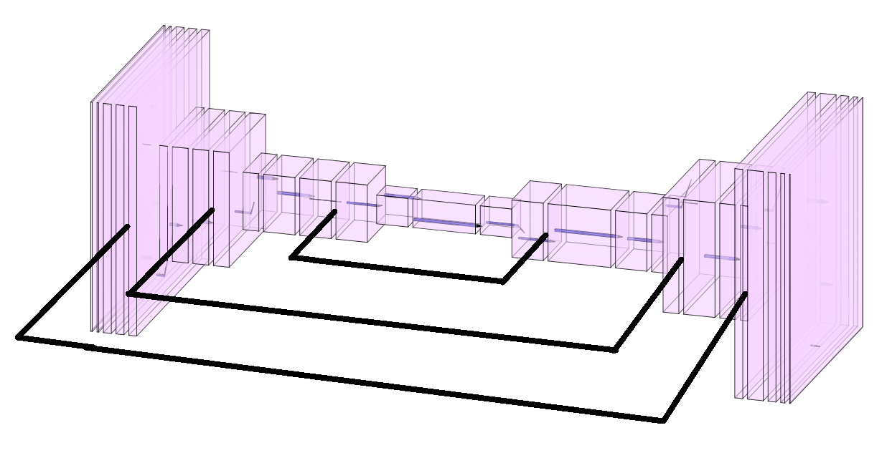

# 3D-Brain-Tumor-Segmentation-PyTorch

| Patient Brain MRI | Tumor Location | Predicted Tumor Location |
|:-:|:-:|:-:|
||||
||||

Image data is sequences of 2d RGB axial MRI scans over a number of patients, and a 2d binary segmentation mask to indicate the location of the tumor. Data is taken from BraTS (Brain Tumor Segmentation) challenge 2018. 

Many images have different dominating hues, such as the following two:
  
|||
|:-:|:-:|

This adds complexity to the data that the model would have to spend time and learning capacity on to undo, with no guarantee that it will do this well, across all color possibilities. I created a method to enforce Global Color Invariance so that our model could converge faster, use fewer parameters, and be guaranteed to be more accurate.

I wanted to preserve color distances while correcting for this color-shifting phenomenon. I decided to turn the problem of global color invariance into the problem of Global Translation and Rotation invariance of point clouds in 3d RGB space. Global Translation invariance was easy to achieve here - just subtract the mean to center the point cloud. For Global Rotation Invariance, I decided to take the eigenvectors of the (centered) point cloud first, and order them by decreasing magnitude. Then, I perform orthogonal projection of the points onto the eigenvectors. This maps all rotations of a cloud in RGB space to the same shape in Eigenvector space because as a shape rotates, so do its eigenvectors. This is essentially performing 1-sample PCA without variance normalization. By ordering the eigenvectors by magnitude, we ensure that we can always snap the eigenvectors to the same axis positions regardless of the rotation of the cloud in RGB space. This method is also robust to noise and slight changes, as small perturbances in RGB space map to smaller perturbances in Eigenvector Basis space.

  |Image|Image as RGB point cloud|Image as Eigenvector Basis point cloud|
  |:-:|:-:|:-:|
  ||||
  ||||

  The second row uses the same image as the first row, with the channels rotated by 1 (RGB -> BRG). This leads to a different Hue while maintaining Saturation & Value, so we can isolate rotation. As we can see, regardless of global translation/rotation in RGB space, the centered Eigenvector Basis representation is the same.

Now that we have a better representation of the images, we can start the training. I experimented with many architectures, revolving around the same theme of having an autoencoder pipeline to improve feature representation along with residual pipelines between the encoder/decoder layers to improve upsampling & pixel-specific annotation, and settled on a U-Net architecture. Here is the diagram of my model, created in [NN-SVG](http://alexlenail.me/NN-SVG) & MS Paint.

  

